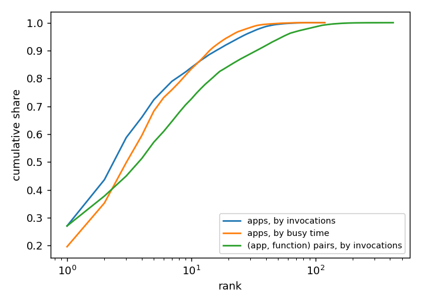
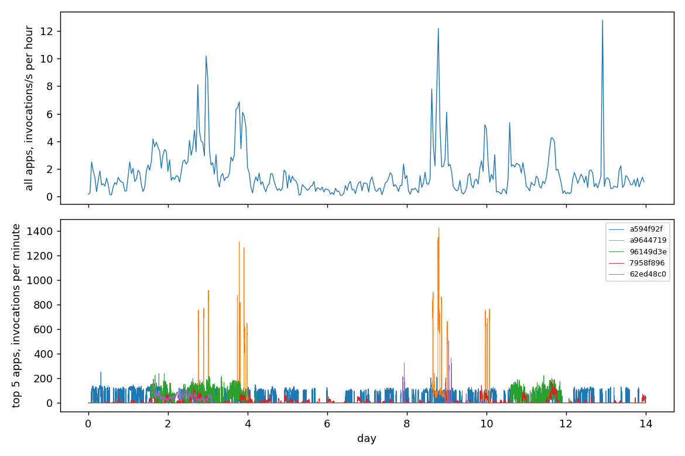
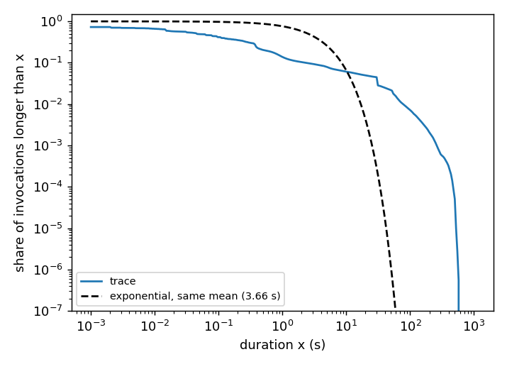

# The Azure Functions 2021 trace

Assessment of the trace as a source of arrival times for the emulator.
Nothing here feeds it in; the service model is untouched.

The trace is the Azure Functions invocation trace for two weeks from
2021-01-31, published with Zhang, Goiri, Chaudhry, Fonseca, Elnikety,
Delimitrou and Bianchini, "Faster and Cheaper Serverless Computing on
Harvested Resources", SOSP 2021, at
[github.com/Azure/AzurePublicDataset](https://github.com/Azure/AzurePublicDataset/blob/master/AzureFunctionsInvocationTrace2021.md)
(18 MB rar, 305 MB text). One row per invocation: app id and function id
(hashed; function ids are unique only within an app), end timestamp in
seconds from the trace start, duration in seconds. Arrival time = end −
duration. 1,980,951 rows, 119 apps, 424 (app, function) pairs, 14.00 days,
1.64 invocations/s in aggregate. The README says the timestamps were
modified from the production trace; the daily and weekly cycles are still
there, so presumably shifted or jittered.

The numbers below are from

    python -m scripts.azure_trace AzureFunctionsInvocationTraceForTwoWeeksJan2021.txt OUT_DIR

which also draws the figures. The trace is not in the repo.

## Aggregation: what is a source

App, not function. Function ids are not comparable across apps, the
median app has 2 functions (max 29), and at function level 136 of the 424
pairs are needed for 99.5% of the traffic. At app level:

| top apps by invocations | 1 | 2 | 5 | 10 | 20 | 50 |
|---|---|---|---|---|---|---|
| share of invocations | 27.0% | 43.6% | 72.3% | 83.9% | 92.5% | 99.4% |

3 apps carry half, 16 carry 90%, 52 carry 99.5%; Gini 0.90 over apps.
The tail is idle: the median app has 415 invocations in 14 days, 42 apps
have fewer than 100, 75 have an invocation in fewer than 10% of the hours,
and no app averages 1/s (5 average more than 0.1/s, 12 more than 1/min).

Rule: rank the apps by invocations, take the top N − 1 as sources and
merge the rest into one. N is free up to 119; N = 6 gives five apps with
72% of the traffic and a remainder with 28%, N = 17 puts 90% in named
apps. One app per source with all 119 gives a hundred sources that are
silent most of the time; hashing apps into N buckets loses the skew.

The trace has counts, not bytes, so every invocation needs a size before
it is a work unit. That choice decides the skew. In the paper the skew is
in bytes, not messages: its sources send 80, 50, 45, 25 and 60 messages/s
(the top two carry 54% of the messages) and P2 and P3 carry 99.4% of the
bytes because their class is 2 MB. With one unit per invocation the top
two apps here carry 44%; weighted by busy time (sum of durations) they
carry 35%, and the two rankings disagree: the five busiest apps by
invocations rank 55, 31, 12, 11 and 19 by busy time. Skew of the paper's
kind has to come from the sizes given to the apps, for instance the
paper's classes tiled over the ranked apps as the generator does.

## Arrival rates over time

The arrival instants are usable: start = end − duration, at full double
precision, no quantization (durations have 1 ms resolution and 8.6% are
recorded as 0, which only matters for the durations themselves). Rates
over time are another matter. Top 10 apps, 1-minute bins:

| app | rate/s | hours active | CV of counts | peak/mean | empty minutes | IoD | CV of inter-arrivals | in bursts |
|---|---|---|---|---|---|---|---|---|
| a594f92f | 0.44 | 71% | 1.5 | 9.5 | 59% | 60 | 55 | 8% |
| a9644719 | 0.27 | 11% | 5.9 | 87 | 90% | 565 | 361 | 33% |
| 96149d3e | 0.25 | 28% | 2.4 | 16 | 80% | 85 | 333 | 24% |
| 7958f896 | 0.12 | 51% | 2.4 | 27 | 70% | 41 | 39 | 4% |
| 62ed48c0 | 0.10 | 15% | 3.5 | 82 | 87% | 76 | 208 | 7% |
| 70b9cea7 | 0.06 | 27% | 11.5 | 365 | 98% | 473 | 53 | 93% |
| 5fb02cfe | 0.05 | 100% | 2.9 | 165 | 34% | 25 | 3.3 | 5% |
| 73e9cf25 | 0.03 | 12% | 3.6 | 16 | 92% | 22 | 70 | 2% |
| 6e42a4e8 | 0.03 | 25% | 25.6 | 1499 | 96% | 1019 | 41 | 46% |
| 734272c0 | 0.03 | 94% | 3.3 | 59 | 47% | 17 | 5.9 | 53% |

IoD is the variance/mean of the per-minute counts; "in bursts" is the
share of inter-arrivals under 50 ms. A Poisson process at these rates
would have CV of counts 0.2 (top app) to 0.75 (tenth), IoD 1 and CV of
inter-arrivals 1. What the trace has instead is bursts separated by
silence: over all apps 73% of same-app inter-arrivals are under 1 s and
3% over a minute; 4 of the top 10 apps have no invocation on 7 to 10 of
the 14 days; one (734272c0) runs on a 60 s timer, 35% of its inter-arrivals
within 2% of 60 s. The aggregate has a daily cycle, 0.87/s to 2.78/s by
hour of day (3.2x), and a weekly one, 46,693 invocations on the first
Saturday against 289,782 on the first Wednesday (6.2x); the second week
is flatter.

At real time the top app puts 2.2 invocations into a 5 s window and 73%
of windows are empty, so nothing the windowed modes measure would move.
Compressing time 37x (one unit per invocation, aggregate equal to the
paper's 60.43 units/s) gives it 82 per window, but the count CV is 1.35
against 0.11 for Poisson and 54% of windows are still empty. The
burstiness is in the structure, not the rate; compression does not remove
it. The 14-day mean per source is a well-defined λ_i; a per-window rate
is not, and any controller that estimates rates from windows would be
chasing bursts.

## Burstiness and skew against the paper

Skew: mild by the paper's standard. The paper's two big sources carry
99.4% of the offered load; the two busiest apps here carry 44% of the
invocations and 35% of the busy time, with 16 apps needed for 90%.
Burstiness: far beyond anything Poisson; see the table. An emulator run
on these arrivals is a test of the algorithm under non-stationary,
bursty, timer-driven input, not a test of its convergence on a fixed λ.

## Licensing

The trace README: "The data is made available and licensed under a CC-BY
Attribution License"; the repository's LICENSE is Creative Commons
Attribution 4.0 International, which permits reproducing, sharing and
adapting the material in whole or in part, given attribution, a link to
the license and a note of what was changed. The required citation is the
SOSP 2021 paper above. So a paper artifact may carry the raw trace or a
derived per-source arrival file; the ids are already hashed and the
timestamps already modified by Microsoft. The 305 MB text file is better
fetched by URL than checked in; a derived arrival file for the chosen N
would be small.

## Durations against the exponential service

The emulator serves a work unit at an exponential time with rate μ. The
trace's durations are nothing like that:

| mean | median | p90 | p95 | p99 | p99.9 | max | CV |
|---|---|---|---|---|---|---|---|
| 3.665 s | 46 ms | 2.3 s | 19 s | 78 s | 260 s | 579 s | 5.28 (exponential: 1) |

33.5% are under 10 ms, 58.5% under 100 ms, 13.8% over 1 s, 1.5% over
60 s; 27% of the nonzero values sit at the 1 ms floor. Per-app means run
from 1.7 ms to 128 s, and within the five busiest apps the CV is 2.2 to
8.5, so there is no single distribution to fit either.

Using them as service times would turn the brokers into M/G/1 queues
with app-dependent service; by Pollaczek-Khinchine the mean queueing
delay at a given utilization would be (1 + CV²)/2 = 14 times the M/M/1
value, and C_j = μ_j/(μ_j − Λ_j)² would no longer be the delay derivative
the prices are built on. That is a different model, not a data option.

## First cut

Arrival instants only: rank apps, top N − 1 plus a merged remainder, one
work unit (or a paper class) per invocation, time compressed to the
offered load wanted, exponential service at the configured μ as now.
Durations stay out.
